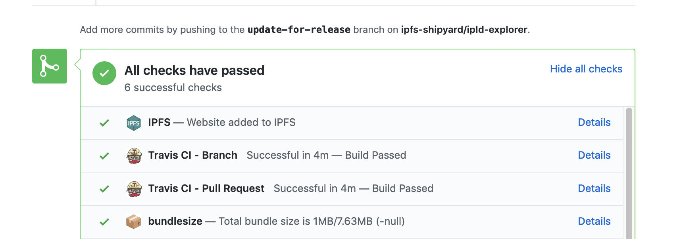

# ipfs-dns-deploy

> A docker image for pinning sites to cluster, notifying github, and updating dns



Use this image to add a site to IPFS as part of a circleci build and deploy workflow.

This image contains:

- [`ipfs-cluster-ctl`] - Pin the site root to our IPFS Cluster
- [`dnslink-dnsimple`] - Update DNSLink TXT records via the DNSimple api
- [`pin-to-cluster.sh`] - The script to tie it all together

### What it does

- `pin-to-cluster.sh` sends the `BUILD_DIR` over http via the `ipfs-cluster-ctl` cli to `/dnsaddr/cluster.ipfs.io`. You can override which cluster to use by setting the `CLUSTER_HOST`.
- If it pins to cluster successfully, the  `pin-to-cluster.sh` returns the root CID.
- If a `GITHUB_TOKEN` is set in the `environment`, the command also sets the CID as a GitHub status for that commit. This is nice, as it means you can grab a CID for any commit on your repo from GitHub, and you get a nice IPFS status bar on PRs which always shows the most recent CID for latest commit on that PR. It's a little obscure, but you can find the CID for any successfully pinned commit from the commits log by clicking on the green check next to the commit and clicking on the details link for the IPFS item.


- Once you have the CID, you get creative... want to publish that CID under DNSLink? Sure! The image comes with `dnslink-dnsimple` baked in, so you can pass it the CID and have it update the TXT record for you.
- To check that setting the DNSLink worked, you can ask IPFS what it thinks the current CID is for a given domain

```console
$ ipfs dns libp2p.io
/ipfs/QmaYRVyPKpN8FXy9HS1t9Zhtjo4RpYXgiuNj1ins9fiLuW
```

or, if you want to be double sure, you can ask dig

```console
$ dig _dnslink.libp2p.io -t TXT +short
"dnslink=/ipfs/QmaYRVyPKpN8FXy9HS1t9Zhtjo4RpYXgiuNj1ins9fiLuW"
```

## Usage

This `circleci/config.yml` config will

- Add the `BUILD_DIR` to our [IPFS Cluster](https://cluster.ipfs.io)
- Update the PR with an IPFS deploy status and preview url
- Update a [DNSLink](https://docs.ipfs.io/guides/concepts/dnslink/) for the domain via dnsimple

```yaml
version: 2
jobs:
  build:
    docker:
      - image: circleci/node:10.15.1
    steps:
      - checkout
      - run:
          command: npm ci
      - run:
          command: npm run build
      - persist_to_workspace:
          root: .
          paths:
            - build

  deploy:
    docker:
      - image: olizilla/ipfs-dns-deploy
        environment:
          DOMAIN: peerpad.net
          DEV_DOMAIN: dev.peerpad.net
          BUILD_DIR: build
    steps:
      - attach_workspace:
          at: /tmp/workspace
      - run:
          name: Add to IPFS
          command: |
            pin_name="$DOMAIN build $CIRCLE_BUILD_NUMBER"

            hash=$(pin-to-cluster.sh "$pin_name" /tmp/workspace/$BUILD_DIR)

            echo "Website added to IPFS: https://ipfs.io/ipfs/$hash"

            # Update DNSlink for prod or dev domain
            if [ "$CIRCLE_BRANCH" == "production" ] ; then
              dnslink-dnsimple -d $DOMAIN -r _dnslink -l /ipfs/$hash

            elif [ "$CIRCLE_BRANCH" == "master" ] ; then
              dnslink-dnsimple -d $DEV_DOMAIN -r _dnslink -l /ipfs/$hash
            fi

workflows:
  version: 2
  build-deploy:
    jobs:
      - build
      - deploy:
          context: ipfs-dns-deploy
          requires:
            - build

```

You can get creative with the dns updating. In this example, changes to the `master` branch trigger a dns update to the `DEV_DOMAIN`, while changes to a branch called `production` trigger a dns update for the live domain.

## Requirements

The following environment variables should be set

```sh
CLUSTER_USER="<beep>"
CLUSTER_PASSWORD="<boop>"
GITHUB_TOKEN="<needs repo status scope>"
DNSIMPLE_TOKEN="<from an account that controls your domain>"
```

To simplify secret management, set them in a circleci `context` called `ipfs-dns-deploy`
that can be shared across all repos in an github org.

The script assumes it will have access to the circleci variables

```sh
CIRCLE_PROJECT_USERNAME="ipfs-shipyard"
CIRCLE_PROJECT_REPONAME="peer-pad"
CIRCLE_SHA1="f818cb08e0e79fcc203f4d52a1a1dd7c3c832a64"
CIRCLE_BUILD_NUMBER="1870"
```

## Setting up a new org

- Create a circleci context called `ipfs-dns-deploy` for your org
- Add the secrets to that context listed above
- invite the gihub user `@ipfsbot` to the filecoin-project org

## Other examples

Pin to cluster and update the PR with the pin status.

```bash
docker run \
  -e CLUSTER_USER="beep" \
  -e CLUSTER_PASSWORD="boop" \
  -e GITHUB_TOKEN="xyz" \
  -e CIRCLE_PROJECT_USERNAME="ipfs-shipyard" \
  -e CIRCLE_PROJECT_REPONAME="peer-pad" \
  -e CIRCLE_SHA1="f818cb08e0e79fcc203f4d52a1a1dd7c3c832a64" \
  -v build:/tmp/build \
  olizilla/ipfs-dns-deploy \
  pin-to-cluster.sh "dev.peerpad.net" ./build
```

Update the DNSLink for a domain via dnslink-dnsimple

```bash
docker run \
  -e DNSIMPLE_TOKEN="beep" \
  olizilla/ipfs-dns-deploy \
  dnslink-dnsimple -d $DOMAIN -l /ipfs/$HASH -r _dnslink
```

## Updating the Docker image

To rebuild the image

```bash
docker build -t olizilla/ipfs-dns-deploy --build-arg GIT_COMMIT=$(git rev-parse HEAD) .
```

To push a new image to docker hub, login to docker, then

```bash
docker tag olizilla/ipfs-dns-deploy olizilla/ipfs-dns-deploy:1.0
docker push olizilla/ipfs-dns-deploy
```


## Contribute

Feel free to dive in! [Open an issue](https://github.com/ipfs-shipyard/ipfs-dns-deploy/issues/new) or submit PRs.

To contribute to IPFS in general, see the [contributing guide](https://github.com/ipfs/community/blob/master/contributing.md).

[](https://github.com/ipfs/community/blob/master/CONTRIBUTING.md)


## License

[MIT](LICENSE) © Protocol Labs


[`ipfs-cluster-ctl`]: https://cluster.ipfs.io/documentation/ipfs-cluster-ctl/
[`dnslink-dnsimple`]: https://github.com/ipfs/dnslink-dnsimple
[`pin-to-cluster.sh`]: scripts/pin-to-cluster.sh
